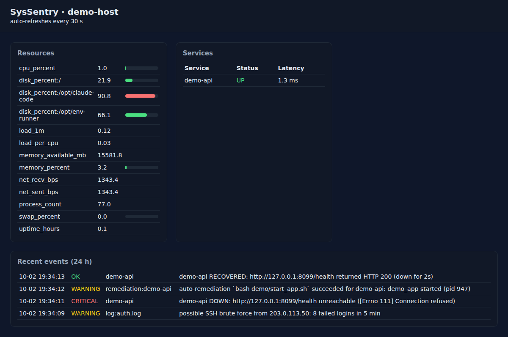

# SysSentry

**A lightweight Linux server health monitor that alerts, auto-heals crashed services and writes the shift-handover report for you.**


Built to answer the questions an on-call / night-shift system engineer gets at 3 AM:
*Is the server healthy? Which service is down? Did someone just try to brute-force SSH? What happened during my shift?*



## What it does

| Area | Details |
|---|---|
| **Resource monitoring** | CPU, memory, swap, per-mount disk usage, load per core, network throughput, process count (via `psutil`) |
| **Service checks** | `systemd` units, TCP ports, HTTP endpoints (status code + body text + latency), running processes |
| **Smart alerting** | warning / critical thresholds, *flap protection* (alert only after N consecutive breaches), per-source cooldown, always-sent "RESOLVED" messages |
| **Alert channels** | console, log file, webhook (Slack / Discord / any HTTP receiver); one failing channel never silences the others |
| **Auto-remediation** | runbook commands per service (e.g. `systemctl restart nginx`), limited attempts then escalate to a human, dry-run mode by default |
| **Log analysis** | incremental tailing of `auth.log` / `syslog` with rotation handling; flags SSH brute-force sources and error spikes |
| **History & reporting** | SQLite storage with retention, Markdown health / shift-handover report with uptime %, peaks and an incident timeline |
| **Dashboard & API** | Flask dashboard plus JSON endpoints (`/api/status`, `/api/metrics/<name>`, `/api/events`, `/healthz`) |
| **Ops tooling** | Nagios-compatible `check` command (exit 0/1/2), `triage.sh` incident snapshot script, systemd unit, cron job, Docker image |

## Architecture

```
            +-------------+   metrics    +-------------+   events   +----------------+
  host ---> | collectors  | -----------> | rule engine | ---------> | alert manager  | --> console / file / webhook
            +-------------+              | (flap-safe) |            | (cooldown)     |
            +-------------+   up/down    +-------------+            +----------------+
services -> |   checks    | -----------> | svc tracker | --DOWN---> | remediator     | --> runbook command (limited retries)
            +-------------+              +-------------+            +----------------+
            +-------------+   matches
  logs ---> |  log scan   | -----------> brute-force / error-spike events
            +-------------+
                     everything is written to SQLite  --->  dashboard / JSON API / Markdown report
```

## Quick start

```bash
git clone https://github.com/aryan-novice/syssentry.git && cd syssentry
python3 -m venv .venv && source .venv/bin/activate
pip install -r requirements.txt

python -m syssentry check              # one-shot health check
python -m syssentry inventory          # host facts as JSON (OS, cores, RAM, disks, IPs)
python -m syssentry -c config.example.yaml run --with-web   # monitor + dashboard on :8085
python -m syssentry report --hours 12  # shift-handover report
```

Sample `check` output (exit code 0 = OK, 1 = WARNING, 2 = CRITICAL, so it plugs into Nagios / Icinga / cron):

```
cpu_percent            0.5  OK
memory_percent         3.2  OK
swap_percent           0.0  OK
disk_percent:/        21.9  OK
load_per_cpu           0.0  OK

OVERALL: OK
```

## See it heal a crashed service

`scripts/demo.sh` starts a small web service, kills it with `kill -9`, injects 8 failed SSH logins into a log file and lets SysSentry react:

```
$ bash scripts/demo.sh
>>> simulating a crash of demo-api (kill -9)
>>> simulating an SSH brute-force attack in demo/auth.log
[2026-10-02 19:34:09] [WARNING] demo-host: possible SSH brute force from 203.0.113.50: 8 failed logins in 5 min
[2026-10-02 19:34:11] [CRITICAL] demo-host: demo-api DOWN: http://127.0.0.1:8099/health unreachable ([Errno 111] Connection refused)
[2026-10-02 19:34:12] [WARNING] demo-host: auto-remediation `bash demo/start_app.sh` succeeded for demo-api: demo_app started (pid 947)
[2026-10-02 19:34:13] [RESOLVED] demo-host: demo-api RECOVERED: http://127.0.0.1:8099/health returned HTTP 200 (down for 2s)
```

The crashed service was detected, restarted and confirmed healthy within the next monitoring cycle, with no human involved. The same run also produces `demo/report.md`:

```
**Status: ATTENTION NEEDED** - 1 critical, 2 warning, 1 resolved events

| Service  | Uptime % | Checks | Avg latency (ms) |
|----------|----------|--------|------------------|
| demo-api | 83.33    | 12     | 1.8              |
```

## Configuration

Everything lives in one YAML file; see [`config.example.yaml`](config.example.yaml). A service with a runbook:

```yaml
services:
  - name: api
    type: http
    url: http://127.0.0.1:8000/health
    expect_text: healthy
    failures_before_alert: 2
    remediation:
      command: ["systemctl", "restart", "api.service"]

remediation:
  enabled: true
  dry_run: true      # log what would run until you trust it
  max_attempts: 3    # then stop and escalate to a human
```

The config is validated at start-up (unknown check types, duplicate names, `warn` above `crit`, bad intervals) and the CLI exits with code 3 on a bad config instead of monitoring with wrong settings.

## Deploying on a server

```bash
sudo ./scripts/install.sh          # creates a 'syssentry' system user, venv in /opt, systemd unit
journalctl -u syssentry -f         # follow the agent
sudo cp deploy/syssentry-report.cron /etc/cron.d/syssentry-report   # 06:00 handover report
```

The [systemd unit](deploy/syssentry.service) runs as an unprivileged user with `ProtectSystem=strict`, `NoNewPrivileges` and auto-restart. To use the built-in `restart` action for real, grant that user a narrow sudoers rule for the specific units only.

Docker:

```bash
docker build -t syssentry .
docker run -d --pid=host -v /var/log:/var/log:ro -p 8085:8085 syssentry
```

## Incident triage script

`scripts/triage.sh` is a standalone Bash script for the first five minutes of an incident. It captures host and kernel info, uptime and load, memory, the top CPU and memory processes, disk and inode usage (flagging anything over 85%), interfaces, listening ports, the default route, a DNS check, failed systemd units, errors from the last 30 minutes and the top SSH brute-force sources. Everything is saved to a timestamped file ready to attach to a ticket.

## Testing

```bash
pip install -r requirements-dev.txt
pytest -q          # 36 tests
ruff check .
shellcheck scripts/*.sh demo/*.sh
```

The tests cover flap protection, escalation and recovery, cooldown and failing channels, remediation limits and dry-run, log rotation and partial lines, real TCP and HTTP checks against a local server, config validation, the full outage-to-recovery cycle, the report and the web API. GitHub Actions runs them on Python 3.10 and 3.12, plus ShellCheck and the end-to-end demo.

## Project layout

```
syssentry/
  collectors.py   host metrics + inventory
  checks.py       systemd / tcp / http / process checks
  rules.py        thresholds with flap protection, service up/down tracking
  logscan.py      incremental log tailing, brute-force + error-spike detection
  alerts.py       channels and cooldown
  remediate.py    runbook execution with attempt limits
  store.py        SQLite storage and retention
  report.py       Markdown health report
  web.py          Flask dashboard + JSON API
  agent.py        the monitoring loop
  cli.py          command line
scripts/          install.sh, triage.sh, demo.sh
deploy/           systemd unit, cron job
```

## Author

**Aryan Raj** · [GitHub](https://github.com/aryan-novice)

Licensed under the MIT License.
